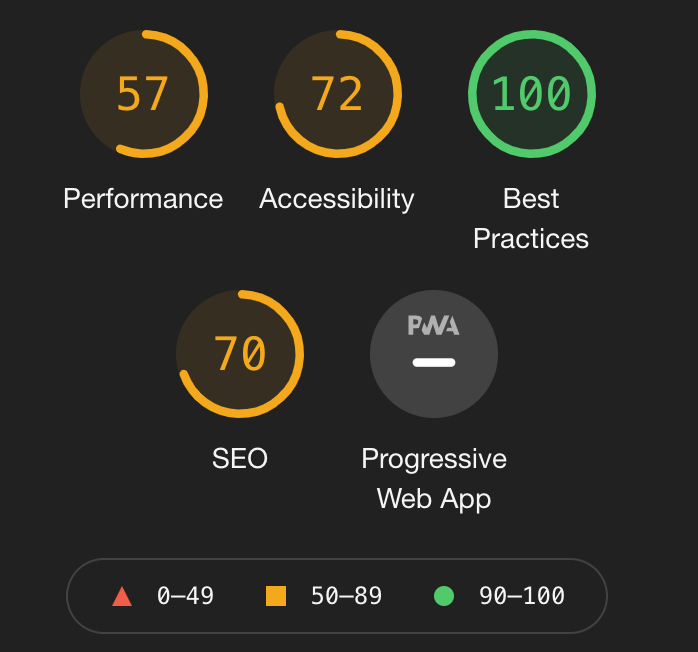
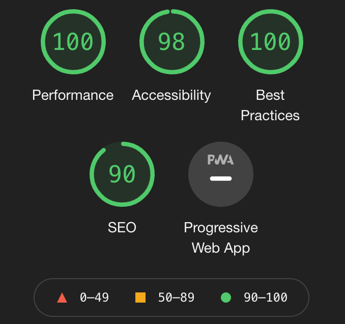

# Homework Week 1 Accessibility: Code Refactor - HTML, CSS, and Git

Refactor a given example to make it more accessible.

## Page Link

Website can be found on GitHub Pages Here: [https://daveholst.github.io/homework-week1-accessibility/]

## Screenshot TODO: Add screenshot

### Complete Page

### Lighthouse Results Before Refactor

### Lighthouse Results After Refactor

## Task

**Refactoring** existing code (improving it without changing what it does) to meet a certain set of standards or to implement a new technology is a common task for front-end and junior developers. For this particular homework assignment, a marketing agency has hired you to refactor an existing site to make it more accessible.

> **Important**: When working with someone else's code, you should adhere to the **Scout Rule**&mdash;always leave the code a little cleaner than when you found it.

An increasingly important consideration for businesses, web **accessibility** ensures that people with disabilities can access a website using assistive technologies like video captions, screen readers, and braille keyboards. Accessibility is good for business&mdash;for one thing, accessible sites rank higher in search engines like Google. It also helps companies avoid litigation, which might arise if people with disabilities can't access a website.

Accessibility can include complex requirements, but your tech lead has given you a small list of specific criteria for this project. These criteria are documented in the Acceptance Criteria section.

To impress clients, you should always exceed expectations and improve the codebase for long-term sustainability. For example, check that all links are functioning correctly. You can also increase the efficiency of the CSS by consolidating the selectors and properties, organizing them to follow the semantic structure of the HTML elements, and including comments before each element or section of the page.

Are you ready to begin? Here are this week's homework requirements.

## User Story

AS A marketing agency
I WANT a codebase that follows accessibility standards
SO THAT our own site is optimized for search engines

## Acceptance Criteria

GIVEN a webpage meets accessibility standards
WHEN I view the source code

- [x] THEN I find semantic HTML elements
      WHEN I view the structure of the HTML elements
- [x] THEN I find that the elements follow a logical structure independent of styling and positioning
      WHEN I view the image elements
- [x] THEN I find accessible alt attributes
      WHEN I view the heading attributes
- [x] THEN they fall in sequential order
      WHEN I view the title element
- [x] THEN I find a concise, descriptive title

## Grading Requirements

This homework is graded based on the following criteria:

### Technical Acceptance Criteria: 40%

- [x] Satisfies all of the preceding acceptance criteria plus the following code improvements:
- [x] Application's links all function correctly.
- [x] Application's CSS selectors and properties are consolidated and organized to follow semantic structure.
- [x] Application's CSS file is properly commented.

### Deployment: 32%

- [x] Application deployed at live URL.
- [x] Application loads with no errors. -- only favicon error, one was not provided
- [ ] Application GitHub URL submitted.
- [x] GitHub repository contains application code.

### Application Quality: 15%

- [x] Application resembles mock-up provided in the homework instructions (at least 90%).

### Repository Quality: 13%

- [x] Repository has a unique name.
- [x] Repository follows best practices for file structure and naming conventions.
- [x] Repository follows best practices for class/id naming conventions, indentation, quality comments, etc.
- [x] Repository contains multiple descriptive commit messages.
- [x] Repository contains quality README file with description, screenshot, and link to deployed application.

## Review

You are required to submit the following for review:

- [ ] The URL of the deployed application.
- [ ] The URL of the GitHub repository, with a unique name and a README that describes the project.

## Notes

- Changed CSS and HTML files to 2 space identation. Not sure if this is acceptable in industry?
- Changed image size/quality to speed up pageload.
